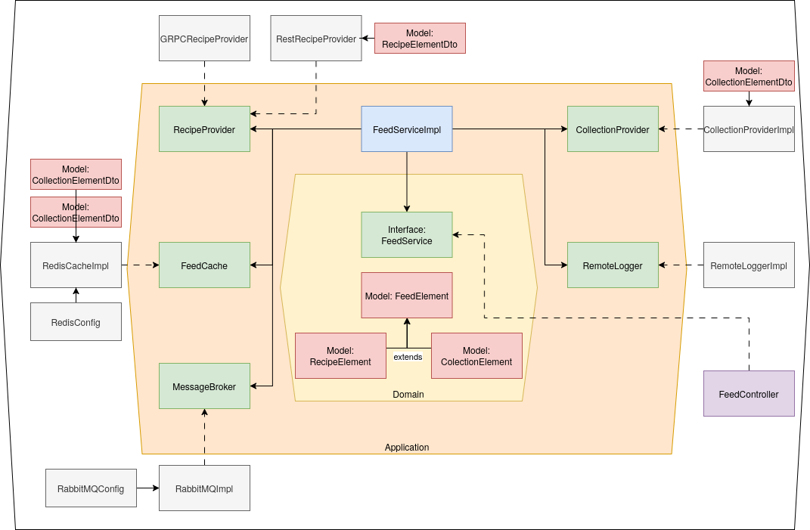

# Feed Service

## Overview
Feed Service is a Spring Boot application that provides APIs to retrieve recipes and collection elements. It integrates with external services and uses Redis for caching.

## Technologies
- Java
- Spring Boot
- Maven
- Redis
- RabbitMQ
- FluentBit
- GRPC

## Architecture


## Configuration
The application configuration is managed through the `application.properties` file. Key properties include:
- `recipe.service.url`: URL of the recipe service
- `collection.service.url`: URL of the collection service
- `spring.data.redis.host`: Redis host
- `spring.data.redis.port`: Redis port
- `spring.data.redis.password`: Redis password
- `spring.rabbitmq.host`: RabbitMQ host
- `spring.rabbitmq.port`: RabbitMQ port
- `spring.rabbitmq.username`: RabbitMQ username
- `spring.rabbitmq.password`: RabbitMQ password
- `fluentd.host`: FluentBit host
- `fluentd.port`: FluentBit port

## API Endpoints

### Get Recipes
- **URL**: `/api/v1/feed/$user/$page`
- **Method**: `GET`
- **Description**: Retrieves a list of feed elements from the service.
- **Response**:
```json
[
	{
		"id": "1",
		"name": "Meine Collection 1",
		"description": "Dies ist Gustavs Rezept-Kollektion",
		"author": "1",
		"type": "collection"
	},
	{
		"id": "3",
		"name": "Meine Collection 3",
		"description": "Dies ist Annas Rezept-Kollektion",
		"author": "2",
		"type": "collection"
	},
	{
		"id": "1",
		"name": "Meine Collection 1",
		"description": "Dies ist Gustavs Rezept-Kollektion",
		"author": "1",
		"type": "collection"
	},
	{
		"id": "ecae6003-9e0a-4e11-9f7e-cf7b0fe6e8b0",
		"name": "Spaghetti Carbonara",
		"description": "Spaghetti Carbonara is a classic Italian pasta dish that is quick and easy to make. The creamy sauce is made with pancetta, eggs, and Parmesan cheese. This recipe uses spaghetti, but you can use any pasta you like.",
		"type": "recipe"
	},
	{
		"id": "2",
		"name": "Meine Collection 2",
		"description": "Dies ist Gustavs Rezept-Kollektion",
		"author": "3",
		"type": "collection"
    }
]
```
